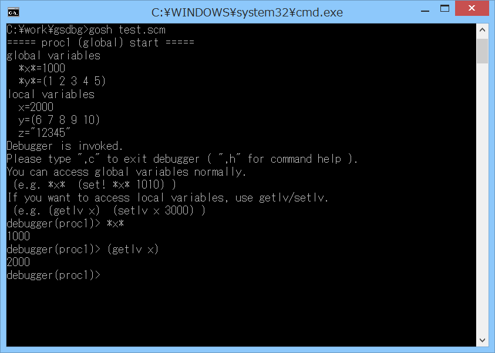

# gsdbg



## 概要
- Gauche で、スクリプトのデバッグを行うためのモジュールです。  
  現状、制限事項がいろいろと存在します。


## インストール方法
- gsdbg.scm を Gauche でロード可能なフォルダにコピーします。  
  (例えば (gauche-site-library-directory) で表示されるフォルダ等)


## 使い方
- スクリプトファイル内で (use gsdbg) によりモジュールを読み込み、  
  デバッガを起動したい箇所に gsdbg 手続きを記述してください。  
  gsdbg 手続きの書式は以下の通りです。

  - `(gsdbg [prompt-add] [local-vars])`  
    デバッガを起動します。

    - 第1引数の prompt-add には、プロンプトに追加で表示する文字列を指定します。  
      (デバッガを起動した位置が分かるような文字列を指定することを想定しています)  
      prompt-add に #f を指定すると、プロンプトに文字列を追加しません。  
      prompt-add は省略可能です。省略した場合は、#f を指定したことになります。

    - 第2引数の local-vars には、ローカル変数の名前と値の組を、  
      '((name1 value1) ...) のようにリストのリストで指定します。  
      現状、デバッガは、ローカル環境を認識することができません。  
      このため、デバッガ内でローカル変数を参照したい場合には、  
      本引数でユーザが明示的に指定する必要があります。  
      本引数で指定したローカル変数は、後述の ,locvar コマンドまたは getlv 手続きで参照可能です。  
      (ただし、デバッガ内でローカル変数の値を変更することはできません)  
      local-vars に #f を指定すると、ローカル変数の指定なしになります。  
      local-vars は省略可能です。省略した場合は、#f を指定したことになります。

    - ＜例1＞  
      ```
      (use gsdbg)
      (let ((x 100) (y 200))
        (gsdbg "test1" `((x ,x) (y ,y))))
      ```
      デバッガを起動し、  
      プロンプトに "test1" という文字列を追加し、また、  
      ローカル変数の x と y を、,locvar コマンドで参照可能にします。

    - ＜例2＞  
      ```
      (use gsdbg)
      (guard (e (else (report-error e) (gsdbg "err1")))
        (/ 1 0))
      ```
      エラー発生時にデバッガを起動します。

- デバッガ内では、以下のコマンドが使用可能です。  
  (これらは、Gauche の REPL の トップレベルコマンド として登録されており、  
  各コマンドは、カンマ記号で始まります (括弧の入力は不要です))  
  (トップレベルコマンドのヘルプは ,h で確認できます)

  - `,continue` または `,c`  
    デバッガを終了し、スクリプトの実行を再開します。

  - `,go`  
    デバッガを終了し、スクリプトの実行を再開します。  
    ただし、これ以後、gsdbg 手続きがあっても、デバッガを起動しません。

  - `,quit`  
    スクリプトを終了します。

  - `,backtrace` または `,bt`  
    バックトレースを表示します。

  - `,curmod` または `,cm`  
    現在選択中のモジュール (カレントモジュール) の名前を表示します。

  - `,selmod [module]` または `,sm [module]`  
    現在選択中のモジュール (カレントモジュール) を切り換えます。  
    引数には、モジュール名を指定します。  
    引数を省略した場合には、user モジュールが選択されます。  
    (モジュールの内部のグローバル変数を参照したい場合には、  
    本コマンドで、モジュールを切り換えてください)

  - `,locvar [name1 name2 ...]` または `,lv [name1 name2 ...]`  
    ローカル変数を表示します。引数には、ローカル変数名を指定します。  
    複数の引数を指定すると、複数のローカル変数を表示します。  
    ローカル変数は、gsdbg 手続きの local-vars で指定したもののみ指定可能です。  
    引数を省略した場合には、指定可能なすべてのローカル変数が表示されます。  
    (変数の値のみを取り出したい場合には、後述の getlv 手続きを使用してください)

  - `,ret [value]`  
    デバッガの戻り値を設定します。  
    本コマンドで設定しなければ、デバッガの戻り値は未定義値 (`#<undef>`) になります。  
    引数を省略した場合には、現在の設定内容を表示します。

- ＜その他の手続き＞  
  その他、本モジュールには以下の手続きが存在します。

  - `(gsdbg-on)`  
    gsdbg 手続きで、デバッガを起動するようにします (デフォルトの動作)。

  - `(gsdbg-off)`  
    gsdbg 手続きで、デバッガを起動しないようにします。  
    (ただし、gsdbg 手続きが完全に消える訳ではありません)

  - `(getlv name)`  
    デバッガが認識しているローカル変数の値を返します。  
    引数には、ローカル変数の名前を指定してください。  
    ローカル変数は、gsdbg 手続きの local-vars で指定したもののみ指定可能です。


## 制限事項
- 現状、以下の制限事項が存在します。
  - デバッガを起動するために、スクリプト内に gsdbg 手続きを記述する必要がある  
    (gsdbg は、戻り値がある手続きであるため、  
    挿入場所によっては、スクリプトの実行結果が変わってしまう)
  - 動的にブレークポイントを設定できない
  - ステップ実行ができない
  - ローカル環境が見られない  
    → 暫定対策として、gsdbg 手続きにローカル変数の組を引数として渡せるようにした
  - マルチスレッド非対応


## その他 注意事項等
1. 本モジュールは、標準の gauche.interactive.toplevel モジュールの内部情報を使用し、  
   また、一部処理を上書きします。  
   このため、Gauche の将来の変更で動作しなくなる可能性があります。


## 環境等
- OS
  - Windows 8.1 (64bit)
- 言語
  - Gauche v0.9.8
  - Gauche v0.9.7

## 履歴
- 2019-5-6   v1.00 (初版)
- 2019-5-7   v1.01 コメント変更等
- 2019-5-8   v1.02 getlvの処理見直し
- 2019-10-30 v1.03 モジュールの選択は、デバッガ終了時に元に戻すようにした
- 2019-10-31 v1.04 v1.03の変更を元に戻した。,curmodコマンドを追加
- 2019-10-31 v1.05 ,retコマンドの引数を省略した場合には、現在の設定内容を表示するようにした


(2019-10-31)
